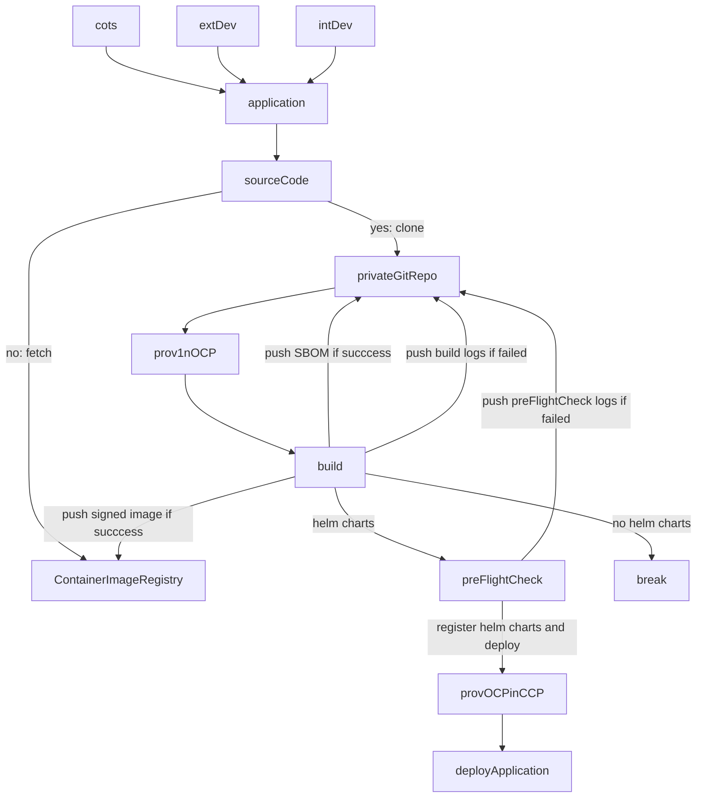

# Standard Application Entry Process (SAEP)

## business requirements
Whatever if applications are bought, built internally or externally, there is a need of defining the golden path, a process to onboard these assets.

This standard process will help fast tracking the time to production as we can guarantee that the target application is compliant with the organization's governance. 

## prerequisites
The following is required to onboard an application through the SAEP: 
* Git repository
* Container image registry 
* An OpenShift target

## workflow overview

is the app
* COTS
* build externally 
* build internally

is the app have all the requirements?
* containerized payload?
    * scan
    * sbom
    * ubi
* deployment method (helm, operator)
* documentation

is containerized
* yes
* no

is there a deploy method
* yes
* no

is there documentation?
* yes 
* no

