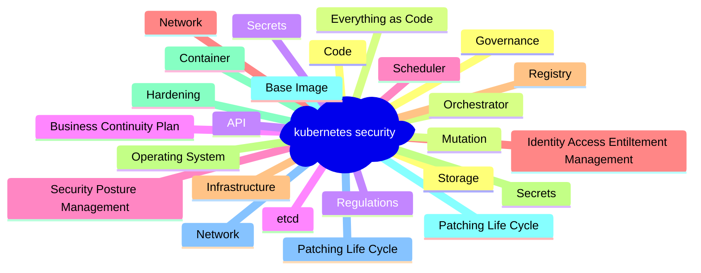

# Keep your Secrets secret!

<!-- 

mindmap
  root((kubernetes security))
    Core
      Operating System 
      Hardening 
      Patching Life Cycle
    Infrastructure
      Identity, Access, Entiltement Management
      Security Posture Management
      Network Security Zone
      Data Classification
    Business Continuity Plan 
    Container Registry
    Control Plane
      API 
        Authentication
        Segmentations
      etcd 
        Authenthication
        Encryption
      Network
        Ingress
        Egress 
        Policies
        Segmentations
    Worker -->