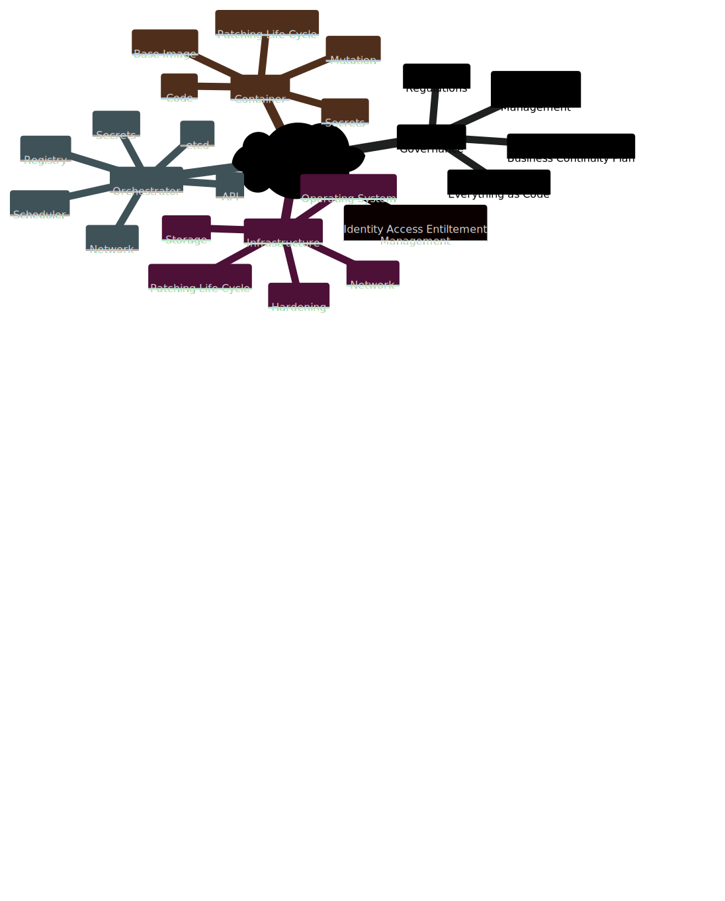
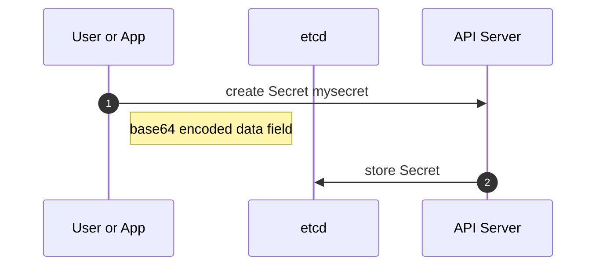
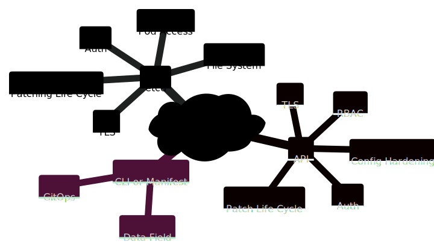
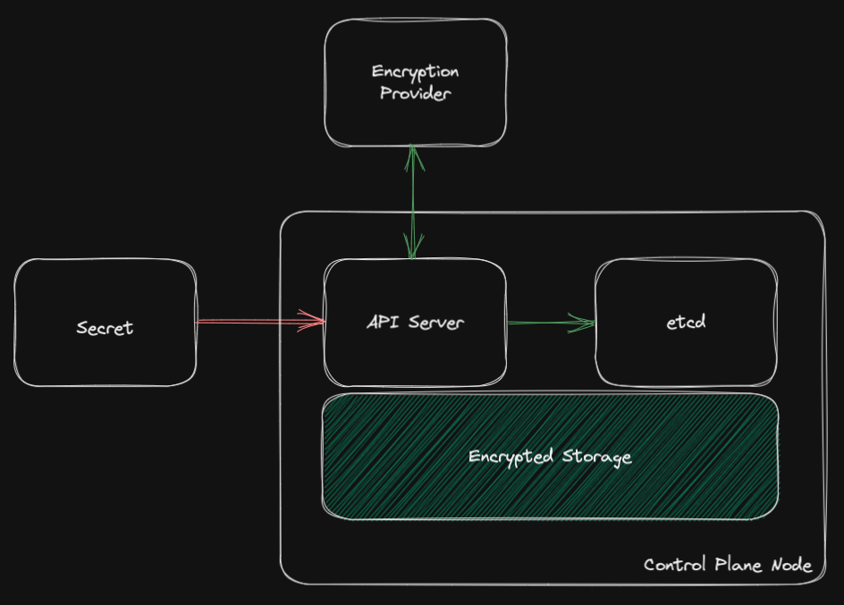

# Keep your Secrets secret!

## Introductory Material 

### Kubernetes Security
Kubernetes is all about providing a high level of abstraction to reduce the application lifecycle dependency on the "from what the entire infrastructure stack is composed of, how it is configured and maintained". Interesting enough, the DevOps movement tries to build bridges to ease the collaboration between the Dev and Ops teams while Kubernetes provides an easy path to a self-service experience for Application teams with a fully decorrelation with the underlying platform.

The absraction does not reduce the importance of architecturing, building and maintaining a
platform within the industry and policy required practices to improve reslience and decrease the risks of cybersecurity breach. Considering the latter, the journey to secure an container platform is overwheelming. The below mindmap helps to define at a high level the different components requiring attention. Here is an example of such mindmap, work in progress and not a definite/static diagram:



<!-- 
This is the mermaid.js manifest for the mindmap diagram
 ```mermaid
mindmap
  kubernetes security
    Governance 
      Everything as Code
      Regulations
      Business Continuity Plan 
      Security Posture Management
    Identity Access Entiltement Management
    Infrastructure 
      Operating System 
      Hardening 
      Patching Life Cycle
      Network
      Storage 
    Orchestrator 
      API
      etcd
      Scheduler 
      Network
      Registry
      Secrets
    Container
      Base Image
      Patching Life Cycle
      Code
      Mutation
      Secrets 
``` -->

This document is focusing on the ```Secrets``` component listed within the above diagram. 

### Kubernetes Secret Object

From an architecture standpoint, Kubernetes has a critical dependency on *etcd*, a key value store, acting as a distributed CMDB tracking the states of every components (from nodes, to config map, to services, ...). If *etcd* fails, the entire cluster will collaspe. If it is hacked, the entire cluster, workloads, and third party components are compromised. 

Yet, *etcd* does not provide any encryption capabilities. Instead, the data field of each Kubernetes API object (e.g. Secrets and ConfigMap), composed or not of sensitive data, will be encoded in base64 to protect the data integrity during client-server exchanges.  

#### Architecture Overview
The below diagram illustrates the Creation opertion workflow of a Kubernetes Secret object: 

!!! info inline end  
    For this diagram, the data field flows through a series of component, usually TLS encupsulated. However, the origin and destination are considered unsafe due to the lack of data encryption.
 


#### Operation Overview
Let's consider that an application needs to connect to an endpoint requesting basic credentials, respectively ```admin``` and ```p@ssw0rd$```. As defined earlier, these value needs to be encoded in based64 to avoid being truncated. This can be done with:

```bash title="credential base64 encoding"
echo 'admin' | base64
echo 'p@ssw0rd$' | base64
```

Then the encoded credentials can be used within an YAML manifest like:  

!!! warning inline end  
    While convenient from a GitOps perspective, the YAML manifest is optional as secrets can be create using the ```kubectl create secret``` command.  
    However, the manifest is **unsafe**; the data field values can be then decoded on any system giving back the original values.

``` title="mysecret.yml"
--8<-- "files/mysecret.yml"
```

Finally, to actually create the secret within the Kubernetes cluster, run the following:

```bash title="create a secret based on a YAML manifest" 
kubectl apply -f mysecret.yml
```

## Iterative Design

### Case Study 

## Attack Surface Overview 
Let's zoom in on the mindmap focusing on Kubernetes CRUD operations to define the potential attack surface and build an iterative mitigation path.



<!-- 
This is the mermaid.js manifest for the mindmap diagram
 ```mermaid
mindmap
  id)kubernetes secrets(
    etcd
      Auth
      File System
      Patching Life Cycle
      Pod Access
      TLS  
    API
      Auth
      Config Hardening
      Patch Life Cycle
      RBAC
      TLS
    CLI or Manifest
      Data Field
      GitOps
``` -->

### etcd

#### Overview

By design, etcd provides a TLS for transport and authentication but no [encryption capabilities](https://etcd.io/docs/v3.5/op-guide/security/#does-etcd-encrypt-data-stored-on-disk-drives). The project's mitigations offered are:  
 
- Let client applications encrypt and decrypt the data
- Use a feature of underlying storage systems for encrypting stored data like [dm-crypt](https://en.wikipedia.org/wiki/Dm-crypt)

In other words, these two options refer to:

- from a Kubernetes perspective, clients are the CLI toolings via the API server;
    - tools like ```kubectl``` or others would have encryption capabilities to secure the data field.  
      However, within the context of Kubernetes and its workload, it would require both the API server and the applications to somehow know that the data field is encrypted and how to decrypt for CRUD operations.   
    - the Kubernetes API server has an encryption at rest configuration API object  ```EncryptionConfiguration``` to configure [encryption providers](https://kubernetes.io/docs/tasks/administer-cluster/encrypt-data/). This approach streamlines the process as every CRUD operations depends on the API server which will handle the encryption/decryption requests.  
- from a deployment perspective, etcd will consume available storage from the master node(s), storage that could be encrypted using different options, one being dm-crypt.  
  
#### Mitigation

While the CLI tooling approach might address the unsecure manifest and ease GitOps practice, it would be a rather significant implementation. Reducing the implementation complexity by using the existing ```EncryptionConfiguration``` would ease the consumption of secrets but leave the Ops with an unsecure manifest. 

While using the ```EncryptionConfiguration``` protects the data field for Secrets and ConfigMap, it does not encrypt all the other API object definition like Pods, Services, StatefulSet, ...

While encrypting the data at the disk/file system level will protect any CRUD operations on the etcd content being written on disk, it will not protect against unauthorized etcd client access.

***Therefore, both options are required to reduce the blast radius.***  

!!! success
    Encrypt all master node(s) disk or/and any storage endpoint used by etcd.  
    Leverage the Kubernetes ```EncryptionConfiguration``` to handle data field encryption operation via the API server and a defined provider (See [API](#API) for more details).

!!! bug 
    A request for enhancement to the Kubernetes project might be required to provide encryption for every API object definition. 



### Manifest

#### Overview

One would consider to simply use the ```kubectl``` command to create the secret and it would be fine if the workstation is hardened to avoid memory and console footprints. This would reduce the autonomy and velocity of an agile development leveraging a container platform as it will require a manual request to the credential owner to inject the secret with the platform before any deployment activities.   

Another would consider that applications have to rely on a Key Management Service (KMS) to retrieve their secrets instead of using the unsecure etcd. This approach removes the security burden of managing secrets within Kubernetes. While from application/workload perspective it might be feasible, Kubernetes core components might not be able to for resilience reasons. If a core component, network or storage related, would not be able to access the KMS to retrieve. Here are some examples:

- network components like CoreDNS, NGINX, ...
- storage components like Ceph, Ondat, ... 
- persistent volume being encrypted at rest and storing their encryption key as secrets
- cert-manager storing the private certificate
- Service Accounts 

Here is two example of secrets created by a freshly deployed Kubernetes clusters from different vendors:

```bash title="OpenShift Local (CRC)"
[root@localhost ~]# oc get nodes -A   
NAME                 STATUS   ROLES           AGE   VERSION
crc-t6jgr-master-0   Ready    master,worker   44d   v1.24.6+5157800
[root@localhost ~]# oc get secrets -A |wc -l
     834
[root@localhost ~]# oc get secrets -A 
...
hostpath-provisioner                               csi-hostpath-provisioner-sa-dockercfg-d7xnc                     kubernetes.io/dockercfg               1      43d
hostpath-provisioner                               csi-hostpath-provisioner-sa-token-wvrpf                         kubernetes.io/service-account-token   4      43d
hostpath-provisioner                               csi-provisioner-dockercfg-ddb6w                                 kubernetes.io/dockercfg               1      43d
hostpath-provisioner                               csi-provisioner-token-jgq9b                                     kubernetes.io/service-account-token   4      43d
...
openshift-apiserver-operator                       openshift-apiserver-operator-dockercfg-ffh89                    kubernetes.io/dockercfg               1      44d
openshift-apiserver-operator                       openshift-apiserver-operator-serving-cert                       kubernetes.io/tls                     2      44d
openshift-apiserver-operator                       openshift-apiserver-operator-token-79c76                        kubernetes.io/service-account-token   4      44d
...
openshift-config                                   etcd-client                                                     kubernetes.io/tls                     2      44d
openshift-config                                   etcd-metric-client                                              kubernetes.io/tls                     2      44d
openshift-config                                   etcd-metric-signer                                              kubernetes.io/tls                     2      44d
openshift-config                                   etcd-signer                                                     kubernetes.io/tls                     2      44d
openshift-config                                   htpass-secret                                                   Opaque                                1      43d
openshift-config                                   initial-service-account-private-key                             Opaque                                1      44d
openshift-config                                   login-template                                                  Opaque                                1      43d
openshift-config                                   pull-secret                                                     kubernetes.io/dockerconfigjson        1      44d
openshift-config                                   support                                                         Opaque                                1      44d
openshift-config                                   webhook-authentication-integrated-oauth                         Opaque                                1      44d
...
openshift-sdn                                      sdn-controller-metrics-certs                                    kubernetes.io/tls                     2      44d
openshift-sdn                                      sdn-controller-token-77dpc                                      kubernetes.io/service-account-token   4      44d
openshift-sdn                                      sdn-dockercfg-vp4kz                                             kubernetes.io/dockercfg               1      44d
openshift-sdn                                      sdn-metrics-certs                                               kubernetes.io/tls                     2      44d
```

```bash title="Rancher Kubernetes Engine 2"
[root@localhost ~]# kubectl get nodes -A
NAME                    STATUS   ROLES                       AGE     VERSION
localhost.localdomain   Ready    control-plane,etcd,master   7m12s   v1.24.9+rke2r1
[root@localhost ~]# kubectl get secrets -A
NAMESPACE     NAME                                        TYPE                 DATA   AGE
kube-system   localhost.localdomain.node-password.rke2    Opaque               1      7m6s
kube-system   rke2-ingress-nginx-admission                Opaque               3      6m16s
kube-system   rke2-serving                                kubernetes.io/tls    2      7m7s
kube-system   sh.helm.release.v1.rke2-canal.v1            helm.sh/release.v1   1      6m54s
kube-system   sh.helm.release.v1.rke2-coredns.v1          helm.sh/release.v1   1      6m54s
kube-system   sh.helm.release.v1.rke2-ingress-nginx.v1    helm.sh/release.v1   1      6m22s
kube-system   sh.helm.release.v1.rke2-metrics-server.v1   helm.sh/release.v1   1      6m22s
```


Considering the GitOps practice, revisioning a Kubernetes Secret manifest would be similar as providing the sensitive data to the entire organization, and even more in case of breach.   

#### Mitigation

### API

#### Overview

#### Mitigation

 

