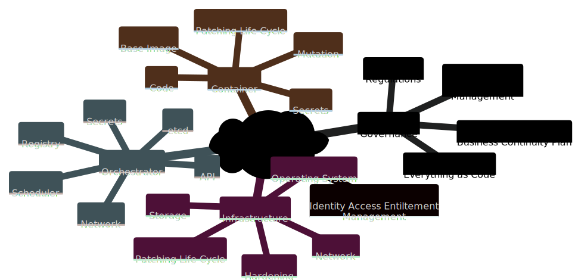

# Keep your Secrets secret!

## Security Overview
The journey to secure a container platform could be overwheelming. Building a layer based or mindmap diagram can help to define the different components requiring attention. Here is an example of such mindmap, work in progress and not a definite/static diagram:




<!-- 
This is the mermaid.js manifest for the mindmap diagram
 ```mermaid
mindmap
  kubernetes security
    Governance 
      Everything as Code
      Regulations
      Business Continuity Plan 
      Security Posture Management
    Identity Access Entiltement Management
    Infrastructure 
      Operating System 
      Hardening 
      Patching Life Cycle
      Network
      Storage 
    Orchestrator 
      API
      etcd
      Scheduler 
      Network
      Registry
      Secrets
    Container
      Base Image
      Patching Life Cycle
      Code
      Mutation
      Secrets 
``` -->

This contribution is focusing on the etcd and secrets components listed within the above diagram. 

## Why etcd & secrets?

The etcd key value store is the most critical piece of a Kubernetes cluster as it servers as a sort of distributed CMDB for every components; from nodes, to configmap, to services, ... If etcd fails, the entire cluster will collapse, if it is hacked, the entire workloads and components are compromised. The key value store does not provide any encryption capabilities. 

Then secret. As everything else, secrets are stored within the cluster etcd. Secret payloads are not encrypted but encoded in base64. This is by default a mechanism to protect the data field payload going through software that might chok on special characters.  

Considering the above, the attach surface is similar to an open door policy. Let's digg into the Kubernetes Secret Management and then see how to mitigate from an end-to-end perspective this unwanted ```open door policy```.

## Kubernetes Secrets 

### Create a secret
Let's consider that an application needs to connect to an endpoint requesting basic credentials, respectively ```admin``` and ```p@ssw0rd$```. As defined earlier, these value needs to be encoded in based64 to avoid being truncated. This can be done with:

```bash title="credential base64 encoding"
echo 'admin' | base64
echo 'p@ssw0rd$' | base64
```

Then the encoded credentials can be used within an YAML manifest like:  

``` title="mysecret.yml"
--8<-- "files/mysecret.yml"
```

Finally, to actually create the secret within the Kubernetes cluster, run the following:

```bash title="create a secret based on a YAML manifest" 
kubectl apply -f mysecret.yml
```

!!! note "CLI only"
    While convenient from a GitOps perspective, the YAML manifest is optional as secret can be create using the ```kubectl create secret``` command.

The above are trivial operations as they are commons to any Kubernetes API objects. However, the sequence workflow might help with the mitigation path. The above operations can be resumed with the following diagram:  


## Kubernetes Project Mitigation 

The address the relative high concern, the [Kubernetes Project](https://kubernetes.io/docs/tasks/administer-cluster/encrypt-data/) advises to leverage the ```EncryptionConfiguration``` API objects to perform encryption at rest for Secrets at creation time. 

