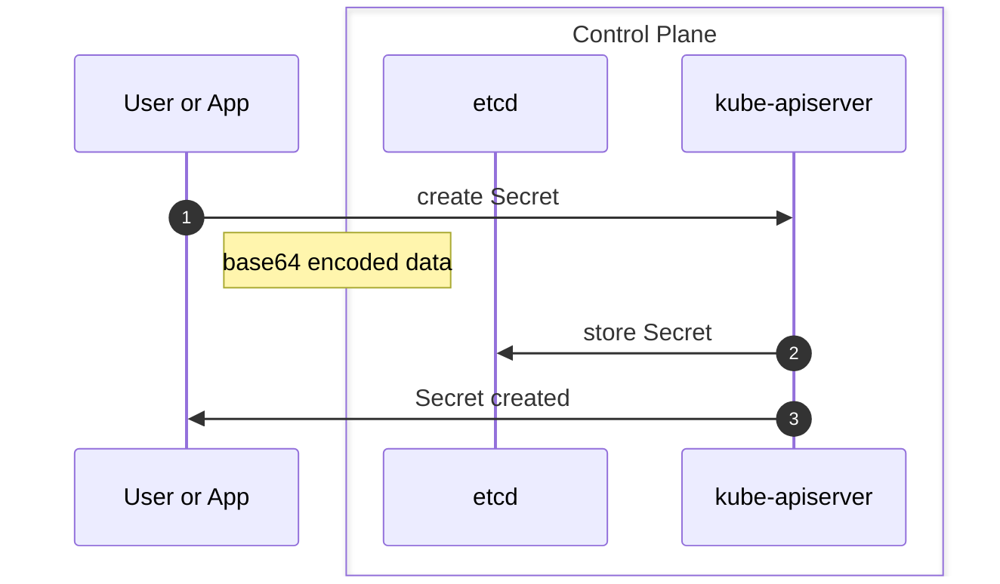
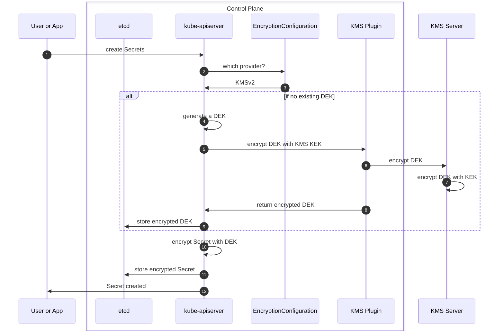

# kleidí

Kleidí, from the Greek ```κλειδί``, means key, the key to secure Kubernetes Secrets with a Kubernetes KMS provider plugin.

## context
```Secrets``` objects in Kubernetes are stored in ```etcd``` with their data field encoded in base64 which is readable by everyone. While applications could see their Secrets being stored externally, the ones used by the platform itself can not be offloaded to avoid a collapse of the platform in case of network partitioning. 

Also, most of the third party solutions attempting to address the Secrets management have a fallback mechanism to the standard Kubernetes Secrets objects. This means that the security exposure is sooner or later to be addressed The Kubernetes project offers options to [encrypt data at rest](https://kubernetes.io/docs/tasks/administer-cluster/encrypt-data/) mitigating to some degrees this security exposure.   

For more details about the security exposure, mitigation path, and production-grade solutions, this handbook I co-authored is a perfect referrence: [Kubernetes Secrets Handbook](https://www.packtpub.com/product/kubernetes-secrets-handbook/).

The only viable option for a productio-grade environment is through the usage of the KMS provider plugin. With the releave of Kubernetes ```1.29```, the kmsv2 is marked stable and documented in the article [KMS provider for data encryption](https://kubernetes.io/docs/tasks/administer-cluster/kms-provider/). 

The ```kleidí``` project will based its efforts on the Kubernetes kmsv2 architecture: 

* provide an universal Key Management Services (KMS) provider plugin for Kubernetes
* learn how to develop a containerized software interacting with the Kubernetes API server 
* leverage AI code generation (including the prompt request within the documentation)
* consider a risk-based approach to design, development, and implementation

<figure markdown>
  { width=512 }
  <figcaption>kleidí Comic Strip generated by DALL-E</figcaption>
</figure>

## kubernetes kmsv2  

Like with networking, storage, cloud providers, and more, Kubernetes provides a high level abstraction to simplify the integration with third party components, and the kmsv2 provider plugin follows the same principle.   

The Kubernetes API Server has been improved over time to include the ability to [encrypt data at rest](https://kubernetes.io/docs/tasks/administer-cluster/encrypt-data/). Different ways can be used to do so with:

* the default ```identity``` mode leveraging the standard base64 encoding -> full exposure 
* the ```aescbc``` or ```aesgcm``` or ```secretbox``` modes with an encryption key -> the key is accessible from the control plane
* the ```kmsv2``` mode leveraging an external KMS server like ```HashiCorp Vault```, ```Azure Key Vault```, ... -> the most secured approach for production-grade needs

### standard ```Secrets``` overview

When creating a ```Secrets``` object with the default mode, ```identity```, the user or application interacts with the Kubernetes API server. From a workflow perspective, we can resume this with the following steps:

1. user or application sends a create operation to the Kubernetes API server
2. assuming there is no existing objects, the Kubernetes API server will store the secrets in ```etcd```
3. the Kubernetes API server (hopefully) returns a creation success status




### the ```kmsv2``` overview



## kleidí design

### requirements

* written in Go
* security first
* rootless; might be difficult considering the GRPC nature
* modular to ease the onboarding of new KMS 3rd party
    * a dummy encryption module using GPG or similar encryption technique
    * leverage a (virtual) Trust Platform Module as a first module
* metrics 
* audit logs 
* Helm Charts and Operator deployment model


### kleidí architecture 


## prototyping


## helm charts


## deploy kleidí

### from source

To clone ```kleidí```'s repository:

```bash
git clone https://github.com/beezy-dev/kleidi.git
```

### from helm charts


