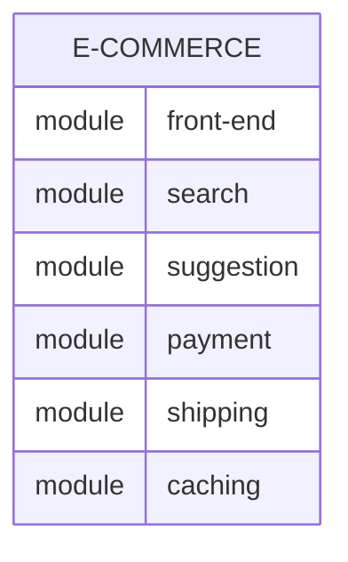
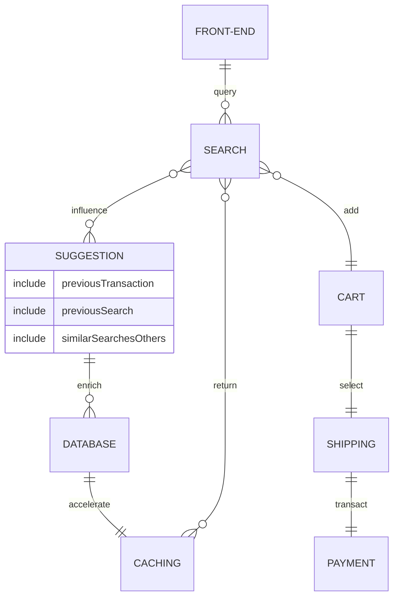

The below concept definitions are based on field user experience and not from an academic standpoint. The latter will have a link to a Wikipedia reference for a non bias definition.  

## Edge
Depending on the industry and core business, the concept of Edge computing might be totally different.  
From a generic standpoint, edge computing is a device outside of the main computing premise of an organization ranging from a branch office to a water level sensor.  

Here are some generic use cases:  

- For retailers like Target, the Point of Sales (PoS) where you checkout is an edge device or the Alexa devices for AWS.
- For banks like Bank of Scotland, the Automated Teller Machine (ATM) where you get cash from is an edge device or the payment device at a retail shop. 
- For telecom companies like NTT Docomo, a cell tower is an edge device or a smartphone is also an edge device.
- For Public Services like USGS, sensors in lakes and rivers are edge devices.
- For a media company like Amazon, a FireTV stick is an edge device.

Within Project Pancake, our Edge device is a piece of equipment hundred miles away from the main computing premise and connected to an untrusted network.   
Considering this scenario, an Edge gateway might be used to repeat the data path from a down- and upstream perspective to avoid data loss. 

[Edge device on Wikipedia](https://en.wikipedia.org/wiki/Edge_device)  

## Container
The concept of container is used to define a way to package an application with the necessary libraries for this application to run.  
That packaging is supposed to run seamlessly on any container platforms regardless of its composition as long as the packaging is respectful of the open standards ([OCI](https://opencontainers.org/about/overview/)).   

In other words, there is no need anymore to perform deep compatibility analysis to ensure an application can run a specific version of Linux with libraries and hardware.   

On top of this, since the container will include the necessary libraries for the application to run, any patching or upgrade at the lower level, aka the Operating System, will not impact the application.  

[Containerization on Wikipedia](https://en.wikipedia.org/wiki/Containerization_(computing)) 

## Microservice
The concept of microservice is often associated with the containerization of applications. While an application could be composed of multiple modules composing a single unit, microservices would decouple these modules in multiple small servides.  

As an example, if an online retail company as an e-commerce, this application might be composed of the following modules:   

- front-end web module
- search module 
- suggestion module
- payment module
- shipping module
- caching module

In a non microservice architecture, also called monolithic architecture, all the modules will be packed within a single unit: 



Within the world of microservice and container, these modules would all have their own container, so 6 containers, instead of 1.  


This approach provides more flexibility from a development and lifecycle perspectice as patching or updating the code from one of the services would not impact the entire stack. 
Also, having the Suggestion module failing will not impact the entire shopping experience but reduce potential upsell.  
Finally, the concept of "Service Mesh" can be introduced to monitor specific metrics that could impact the shopping experience. Here are three examples:  

- If the shopping experience is consider slow or even timeout, each relationship is reporting metrics (e.g. latency) can be analyzed and define which part of the stack is the root cause.
- With microservices, code changes are granular. This allows the dev team to appreciate the impact on the overall experience. 
- Very closed to the previous example, this architecture allows to introduce multiple version of a module within the stack and perform A/B testing scenario with/out user experience feedback.


[Microservices on Wikipedia](https://en.wikipedia.org/wiki/Microservices)  

## Kubernetes
Kubernetes is a platform to orchestrate containers leveraging a set of software to abstract every infrastructure layer (compute, network, storage, security, ...) into plain natural english.  

E.g. Configuring a TLS terminate endpoint for a web application:  

- legacy: interact with LAN, WAN, load balancer and firewall devices, requesting a SSL certificate to a third party and loading it into a load balancer context.  
***This use case requires the expertise of multiple resources with a long lead time.***   
- Kubernetes: using a YAML declarative manifest, the below will create two Services to access a container running a web service, then create an ingress rule for two custom URLs, and generating at creation time the TLS certificate via Let's Encrypt for the NGINX Ingress Controller. Note that at this stage, trying to access the URL on port 80 will trigger an automatic redirect to the TLS endpoint.   
***The below can be handled by the Application Team without the need to wait on the Ops expertise reducing the lead time to the entire software supply chain.***

```YAML
---
apiVersion: v1
kind: Service
metadata:
  name: echo1
spec:
  ports:
  - port: 80
    targetPort: 5678
  selector:
    app: echo1
---
apiVersion: v1
kind: Service
metadata:
  name: echo2
spec:
  ports:
  - port: 80
    targetPort: 5678
  selector:
    app: echo2
---
apiVersion: networking.k8s.io/v1
kind: Ingress
metadata:
  name: echo-ingress
  annotations:
    cert-manager.io/cluster-issuer: "letsencrypt"
    kubernetes.io/ingress.class: "nginx"
spec:
  tls:
  - hosts:
    - echo1.example.com
    - echo2.example.com
    secretName: echo-tls
  rules:
    - host: echo1.example.com
      http:
        paths:
          - pathType: Prefix
            path: "/"
            backend:
              service:
                name: echo1
                port:
                  number: 80
    - host: echo2.example.com
      http:
        paths:
          - pathType: Prefix
            path: "/"
            backend:
              service:
                name: echo2
                port:
                  number: 80
```


[Kubernetes on Wikipedia](https://en.wikipedia.org/wiki/Kubernetes)  

## GitOps
GitOps is an umbrella practice composed of Culture (Dev & Ops working together), Infrastructure-as-Code, and Automation - mainly, if not only, used with Kubernetes.  
GitOps is usually depending on an automation tool, like ArgoCD or FluxCD, accessing Git repositories with either or both infrastructure and application YAML configuration manifests.  
The automation tool will track the configuration state in both the Git repositories and the Kubernetes clusters. If one shows a difference of configuration, a out-of-sync or drift will be notified with the ability to:  

- sync the Kubernetes cluster with the new configuration definition with the Git repository.
- rollback the Kubernetes cluster state with the known one from the Git repository.  
 
[GitOps on Wikipedia](https://en.wikipedia.org/wiki/DevOps#GitOps)  