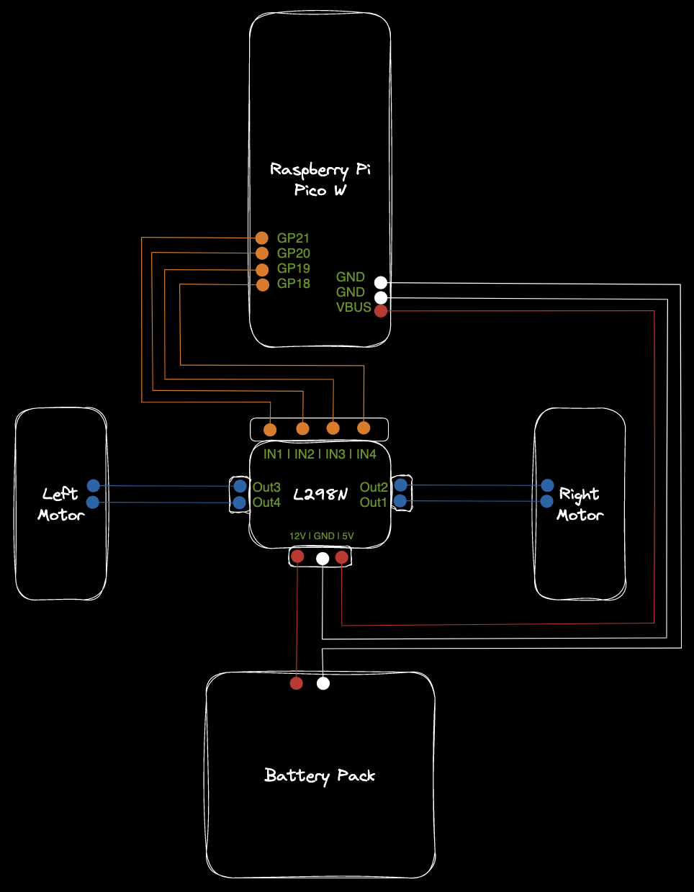

# build the robot

## Requirements

Review the hardware requirements available [here](https://beezy.dev/pancake/#hardware).

The Raspberry Pi PICO might come with pre-soldered pin header. If not, two options:    

- solder the pin header 
- use alligator clip test cable if you don't want to solder

???+ note
    Don't solder the cables directly to the Pi PICO board, use Dupont type cables allowing you to easily change the pin setup without any difficulties. 

## Diagram 

The below diagram shows the basic wiring without the optional components. 

Even if the GPxx are displayed with specific numbers, these could be reassign to any GPxx. This will however require to adapt the code with the new pin numbers. 

???+ warning
    Feeding more than 5v to the Raspberry Pi PICO could burn it!  
    To avoid this, make sure to properly distribute the power from the battery pack directly to the L298N. The module is capable to handle up to 12v as an input and distribute back a 5v output that would power the Raspberry Pi PICO.   
    

