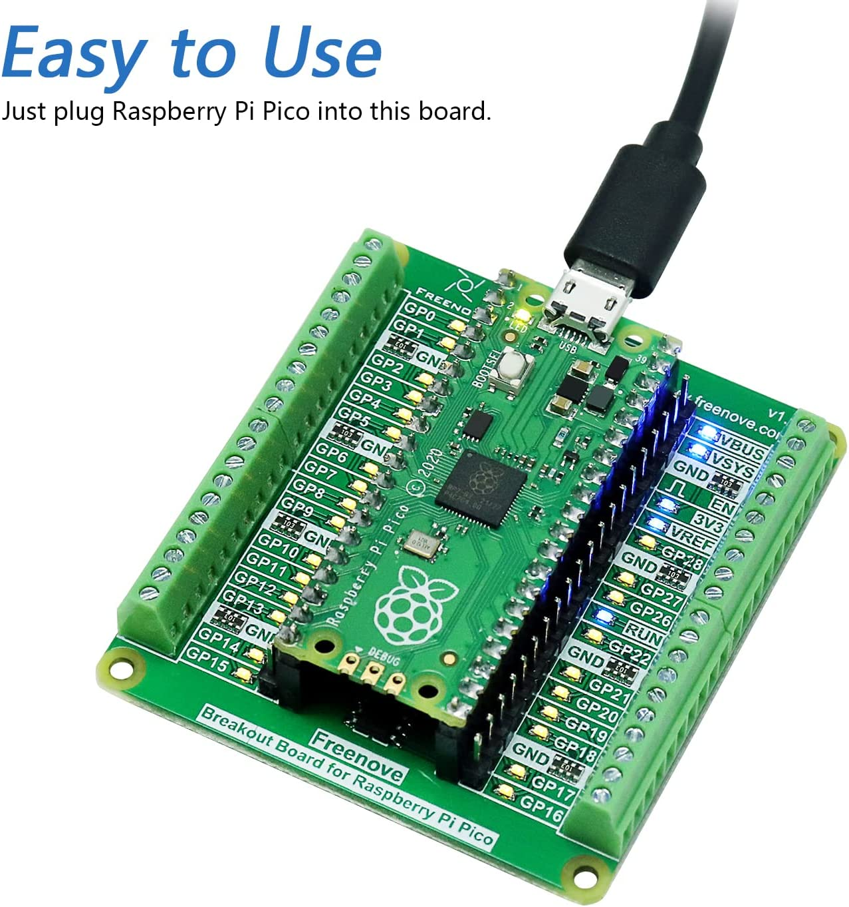

# build a rover

## pico assembly 

To simplify the cabling, the Raspberry Pico W will be mounted on a breakout board from Freenove.

This is approach is optional but provides with, and not limited to, the followings benefits:

- smaller package then using a series of breadboard 
- terminal block with screw (no soldering) and a PIN style header 
- GPIO status LED

The GPIO status LED is a nice addition as it allows to dev on your Pico without any component attach and observe the LED on/off status.

