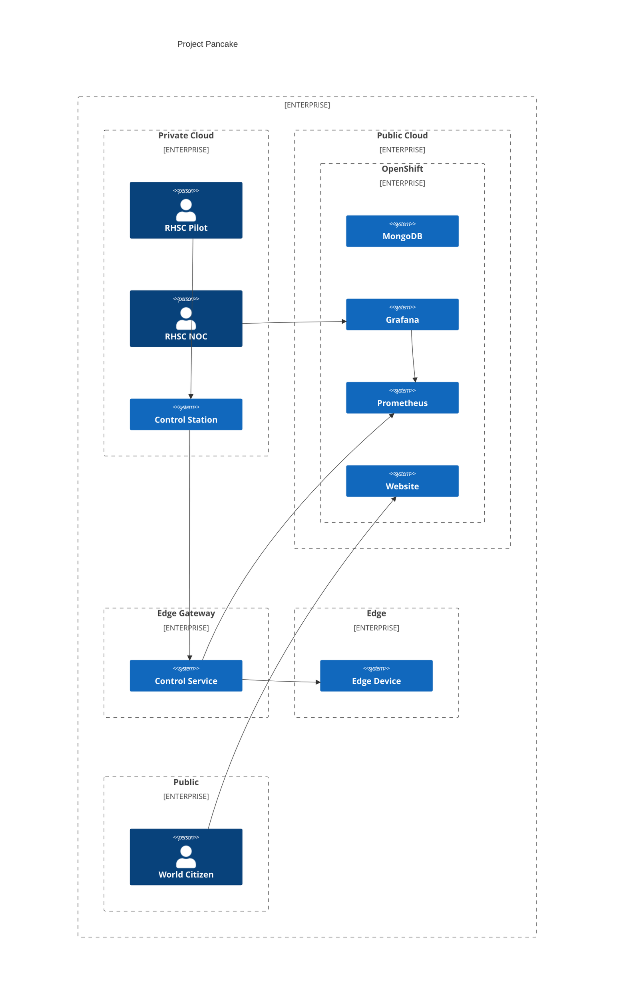

## Overview

```mermaid 
    C4Context
      title Project Pancake
      Enterprise_Boundary(b0, "") {

        Enterprise_Boundary(b3, "Private Cloud"){
          Person(Pilot, "RHSC Pilot")
          Person(Supervisor, "RHSC NOC")
          System(ControlStation, "Control Station")
        }

        Enterprise_Boundary(b2, "Public Cloud") {
          Enterprise_Boundary(c1, "OpenShift"){
            System(MongoDB, "MongoDB")
            System(Grafana, "Grafana")
            System(Prometheus, "Prometheus")
            System(Website, "Website")
          }
        }

        Enterprise_Boundary(b4, "Edge Gateway"){
          System(EdgeGateway, "Control Service")
        }
        
        Enterprise_Boundary(b5, "Edge"){
          System(EdgeDevice, "Edge Device")
        }

        Enterprise_Boundary(b7, "Public"){ 
          Person(Public, "World Citizen")
        }
      }

      Rel(Pilot, ControlStation, "")

      Rel(ControlStation, EdgeGateway, "")
      
      Rel(EdgeGateway, Prometheus, "")
      Rel(Grafana, Prometheus, "")
      Rel(EdgeGateway, EdgeDevice, "")

      Rel(Public, Website, "")
      Rel(Supervisor, Grafana, "")

      UpdateLayoutConfig($c4ShapeInRow="4", $c4BoundaryInRow="2")
```