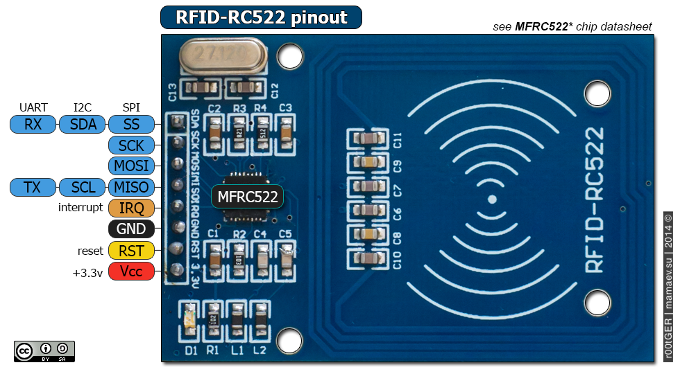

# Ground Detection

## Scenario
During the exploration with the robot, objects located on the surface could be discovered and would trigger a:

- bonus; a special material has been discovered 
- damage; a dangerous material might have damaged the robot

## Hardware
A NFC module, here RC522, with cards and tags, provide with the module, could be randomly placed on the exploration zone.

The RC522 requires 7 pins for the wiring including 2 for power purposes.   



| RC522 | PICO W | 
|-------|--------|
|  VCC  |  3v3   |
|  RST  |  PIN0  |
|  GND  |  GND (next to PIN0) |
|  IRQ  |  - |
|  TX   |  PIN4 |
| MOSI  |  PIN3 |
|  SCK  |  PIN2 |
|  RX   |  PIN1 |


## Software
Sources are available on [Project Pancake](https://github.com/beezy-dev/project-pancake).

The code uses the ```mfrc522``` library, file that need to be copied on the RP2040 for the code to work. 

The below code can be added to provide detection of cards and tags. The actual gamification part is not included. 

```python
## NFC reader ############################################################
# import NFC reader library
from mfrc522 import MFRC522

# connecting to network 
reader = MFRC522(spi_id=0,sck=2,miso=4,mosi=3,cs=1,rst=0)
previousCard = [0]

def cardReader():
    while True: 
        reader.init()
        (stat, tag_type) = reader.request(reader.REQIDL)
        if uid == previousCard:
            continue
        if stat == reader.OK:
            (stat, uid) = reader.SelectTagSN()
            if stat == reader.OK:
                print("Card detected {}  uid={}".format(hex(int.from_bytes(bytes(uid),"little",False)).upper(),reader.tohexstring(uid)))
                defaultKey = [255,255,255,255,255,255]
                reader.MFRC522_DumpClassic1K(uid, Start=0, End=64, keyA=defaultKey)
                print("Done")
                previousCard = uid
            else:
                pass
        else:
            previousCard = [0]
        utime.sleep_ms(50) 
``` 
